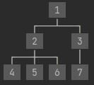
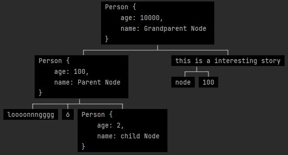
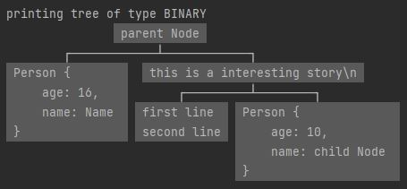

# PrettyPrintTree

This package allows you to print the tree datastructure in a readable fashion (in python).

It supports trees with any kind of data (as long it can be turned into a string).

And even supports multi lined nodes (as in strings with \n).

# Install

```
pip install PrettyPrintTree
```


# Import

```
from PrettyPrint import PrettyPrintTree
```


# Documentation

I tried to make this as flexible as possible, so in order to support multiple types of trees
you need to explain to the program how to print your tree. The way to accomplish this is by passing 2 lambdas (or any other Callable):
1)  get_children: Given a node of your tree type returns an iterable of all its children (from left to right).
    For example if this is your tree implementation:
    ```
    class Tree:
        def __init__(self, val):
            self.val = val
            self.children = []
    ```
    Then get_children would be as simple as: 
    ```
    lambda node: node.children
    ```
    Or if your tree implementation is:
    ```
    class Tree:
        def __init__(self, val):
            self.val = val
            self.child_right = None
            self.child_left = None
    ```
    Then get_children would be: 
    ```
    lambda node: [node.child_left, node.child_right]
    ```

2)  get_value: Given a node of your tree type returns that node's value
    for example if your tree implementation is:
    ```
    class Tree:
        def __init__(self, val):
            self.val = val
    ```
    then get_value would be: 
    ```
    lambda node: node.val
    ```
    (if the value of the tree doesn't implement \_\_str\_\_ get_value should turn it into a string)


In order to print the tree you first need to make a PrettyPrintTree object which you pass your lambdas (and any other settings) to,
then you can call it whenever you want without needing to pass the lambdas each time.


## Examples

```
pt = PrettyPrintTree(lambda x: x.children, lambda x: x.val)
tree = Tree(1)
child1 = tree.add_child(Tree(2))
child2 = tree.add_child(Tree(3))
child1.add_child(Tree(4))
child1.add_child(Tree(5))
child1.add_child(Tree(6))
child2.add_child(Tree(7))
pt(tree)
```



# Other Settings


## Horizontal
You can print trees from left to right (instead of up to down)
```
pt = PrettyPrintTree(lambda x: x.children, lambda x: x.val, horizontal=True)
```


## Trim
Say you only want to print the first few characters of each node (in order to keep the tree small for readability),
then you can set trim to a specific amount of characters.

```
pt = PrettyPrintTree(lambda x: x.children, lambda x: x.val, trim=5)
```


## Return Instead of Print
Instead of printing the tree it can return the string instead if you prefer.

```
to_str = PrettyPrintTree(lambda x: x.children, lambda x: x.val, return_instead_of_print=True)
tree_as_str = to_str(tree)
```


## Color
You can change the bg color of each node, or even just not use color.

```
from colorama import Back

# change color to black:
pt = PrettyPrintTree(lambda x: x.children, lambda x: x.val, color=Back.BLACK)
```

```
# without any color:
pt = PrettyPrintTree(lambda x: x.children, lambda x: x.val, color=None)
```


## Border
You can also surround each node with a little border:
```
pt = PrettyPrintTree(lambda x: x.children, lambda x: x.val, border=True)
```


## Escape NewLines
You can escape \n so that each node will be printed on one line.

Note: \\n wil be escaped into \\\\n so that you can tell the difference
```
pt = PrettyPrintTree(lambda x: x.children, lambda x: x.val, show_newline_literal=True)
```


## Max Depth
You can specify a max depth so that it will only print nodes up to that depth.
This can be done either at the start:
```
pt = PrettyPrintTree(lambda x: x.children, lambda x: x.val, max_depth=10)
```
Or when calling the function:
```
pt(tree, max_depth=5)
```
This will override the max depth set at the start (if any) for this time only.
To have no max depth, you can set it to -1.


## Start Message
You can give a lambda that will be given the tree and will return a string which will be printed before the tree.
```
pt = PrettyPrintTree(lambda x: x.children, lambda x: x.val, start_message=lambda node: f'printing tree of type {node.typ}')
```


# Advanced Examples

## Filtering

To filter specific nodes all you need to do is add a filter in the get_children lambda, eg:
```
PrettyPrintTree(lambda node: filter(lambda n: "to print" in str(n.val), node.children), ...
```
```
PrettyPrintTree(lambda node: [n for n in node.children if n.val > 3.141], ...
```
